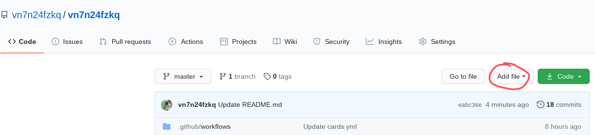
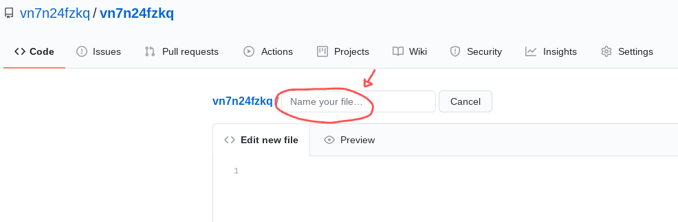
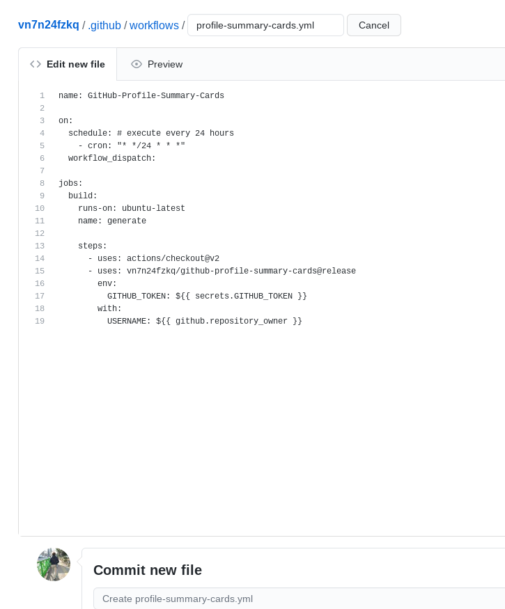
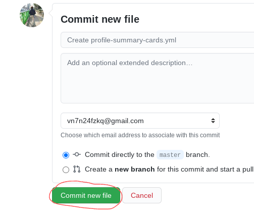
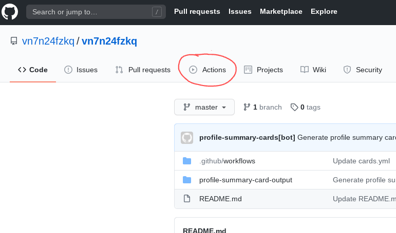
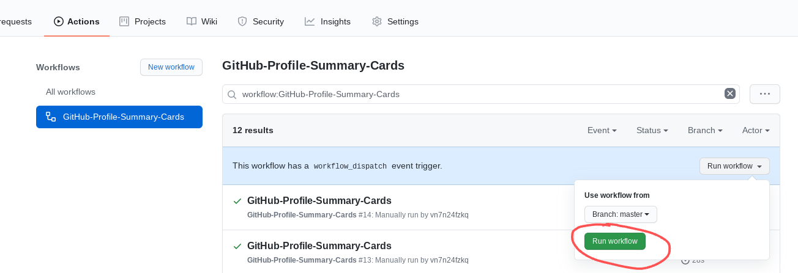
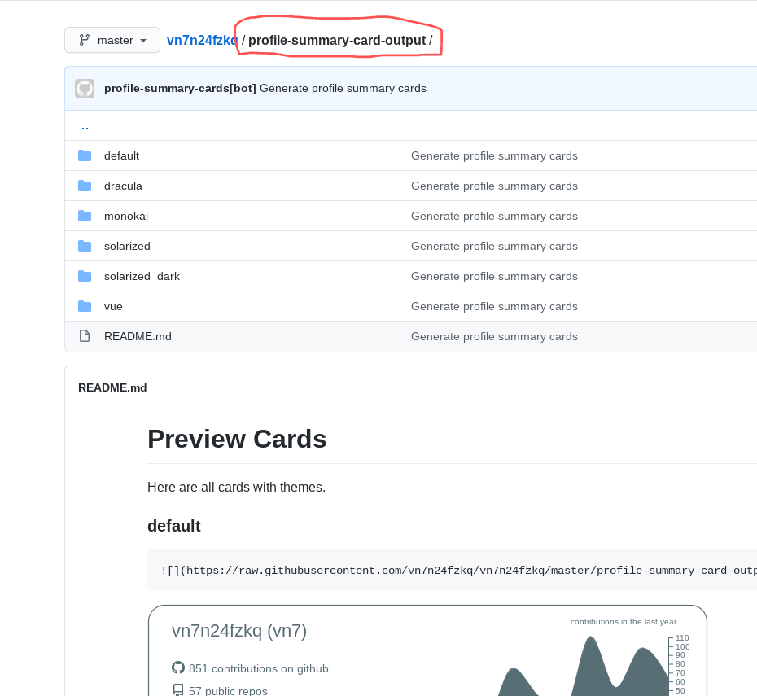

## Requirement

You already has a profile README, if you don't check this [Managing your profile README
](https://docs.github.com/en/github/setting-up-and-managing-your-github-profile/managing-your-profile-readme)

## Let Start it

- Add a workflow file to your profile README repo

  - Find and click the add file button
    
  - Type file name with path `.github/workflows/profile-summary-cards.yml`
    
  - Copy this in to the file

    ```yml
    name: GitHub-Profile-Summary-Cards

    on:
      schedule: # execute every 24 hours
        - cron: "* */24 * * *"
      workflow_dispatch:

    jobs:
      build:
        runs-on: ubuntu-latest
        name: generate

        steps:
          - uses: actions/checkout@v2
          - uses: vn7n24fzkq/github-profile-summary-cards@release
            env:
              GITHUB_TOKEN: ${{ secrets.GITHUB_TOKEN }}
            with:
              USERNAME: ${{ github.repository_owner }}
    ```

    

    - Commit it
      

- Trigger workflow

  - Into github action page.
    
  - Run workflow
    
  - Wait workflow finish (You need to refresh page to see latest workflow)
    

- Get those output and put into profile README
  - profile-summary-card-output
    
