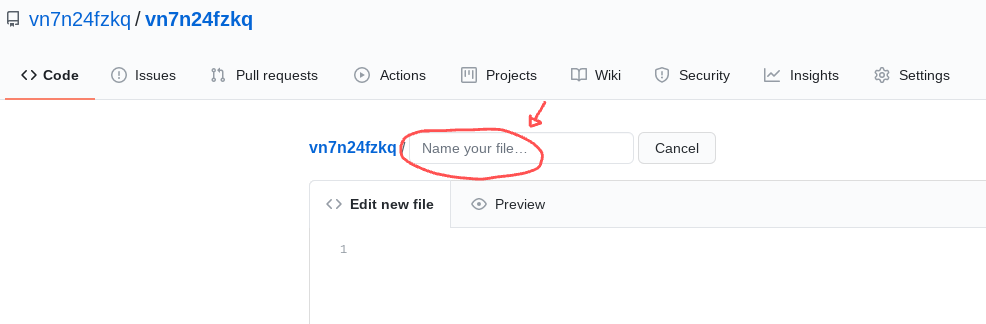
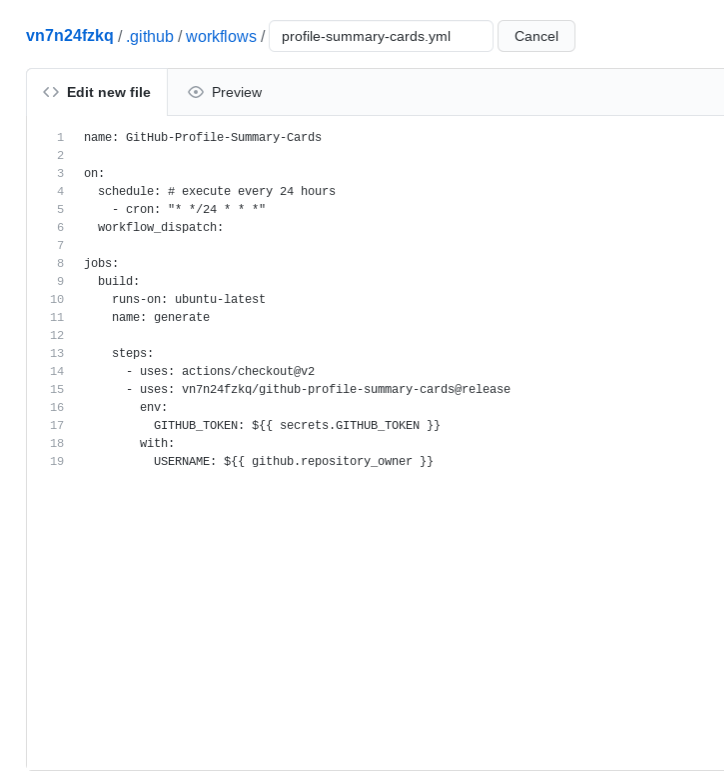
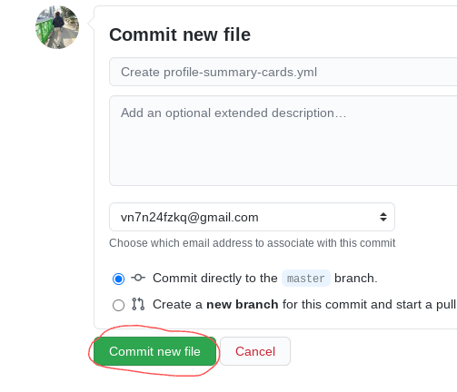
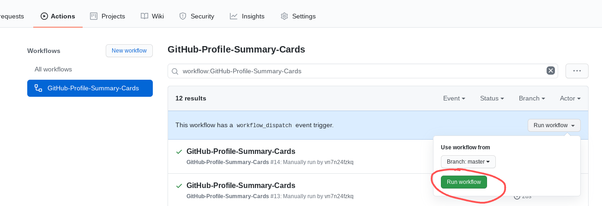

## Let's start

---

### First step

|      We create a Personal access token with permissions we need      |
| :------------------------------------------------------------------: |
|                          1. Find `Settings`                          |
|                                        |
|                     2. Find `Developer Settings`                     |
|                             |
|                   3. Find `Personal access tokens`                   |
|                         |
|                 4. Press `Generate new token` button                 |
|                                  |
|           5. Type access token name and check permissions            |
|                                        |
|        6. Scroll to bottom and press `Generate token` button         |
|                               |
| 7. Then we get the token, copy the token value, we will use it later |
|                                    |

---

### Add to repo

- If you want create a Profile README or create a new repository. [Next Step](#use-template)

- If you want add to a exist repository. [Next Step](#add-personal-access-token-to-repo)

---

### Use template

|                   Open template page [github-profile-summary-cards-example](https://github.com/vn7n24fzkq/github-profile-summary-cards-example)                   |
| :---------------------------------------------------------------------------------------------------------------------------------------------------------------: |
|                                                             Find and press `Use this template` button                                                             |
|                                                                                                                               |
| Type repository name then press `Create repository from template` button (If you want to create a Profile README repository then the name should be you username) |
|                                                                                                                                   |
|                                                                   Now we have a new repository                                                                    |
|                                                                                                                                         |

[Next Step](#add-personal-access-token-to-repo)

---

### Add Github Action to repo

|           We are gonna use the personal token we early copy            |
| :--------------------------------------------------------------------: |
|                    Find and click `Add file` button                    |
|                                     |
| Type file name with path `.github/workflows/profile-summary-cards.yml` |
|                                        |
|                       Copy and paste to the file                       |

```yml
name: GitHub-Profile-Summary-Cards

on:
  schedule: # execute every 24 hours
    - cron: "* */24 * * *"
  workflow_dispatch:

jobs:
  build:
    runs-on: ubuntu-latest
    name: generate

    steps:
      - uses: actions/checkout@v2
      - uses: vn7n24fzkq/github-profile-summary-cards@release
        env:
          GITHUB_TOKEN: ${{ secrets.GITHUB_TOKEN }}
        with:
          USERNAME: ${{ github.repository_owner }}
```

| It should looks likt this one |
| :---------------------------: |
|     |
|      Then we commit file      |
|  |

[Next Step](#add-personal-access-token-to-repo)

---

### Add Personal access token to repo

|                                   We are gonna use the personal token we early copy                                   |
| :-------------------------------------------------------------------------------------------------------------------: |
|                                             Find `Settings` in repository                                             |
|                                                                                   |
|                                          Find secrets in repository settings                                          |
|                                                                                         |
| Now, we type secret name you want and paste the personal access token as secret Value, then press `Add secret` button |
|                                                                           |
|                                              It should has a secret here                                              |
|                                                                                       |

[Next Step](#change-github-action-token)

---

### Change Github Action token

|                   We are almost done!                    |
| :------------------------------------------------------: |
|          Find the github action file just added          |
|                      |
|                And we do some modify this                |
|                           |
| Replace default GITHUB_TOKEN with the secret we jsut add |
|                              |
|                     With new secret                      |
|                             |
|                    Commit this change                    |
|                           |

[Next Step](#trigger-action)

### Trigger action

|               Now the action should automatically start                |
| :--------------------------------------------------------------------: |
|                       We can check workflow runs                       |
|                                       |
|                         Run workflow manually                          |
|                                          |
| Wait workflow finish (You need to refresh page to see latest workflow) |
|                                          |

[Next Step](#everything-are-finished!)

---

### Everything are finished!

|        We can see all cards of each themes 🎉         |
| :---------------------------------------------------: |
| Check profile-summary-card-output folder in your repo |
|                               |
|                 :star: Finish :star:                  |
|                               |
